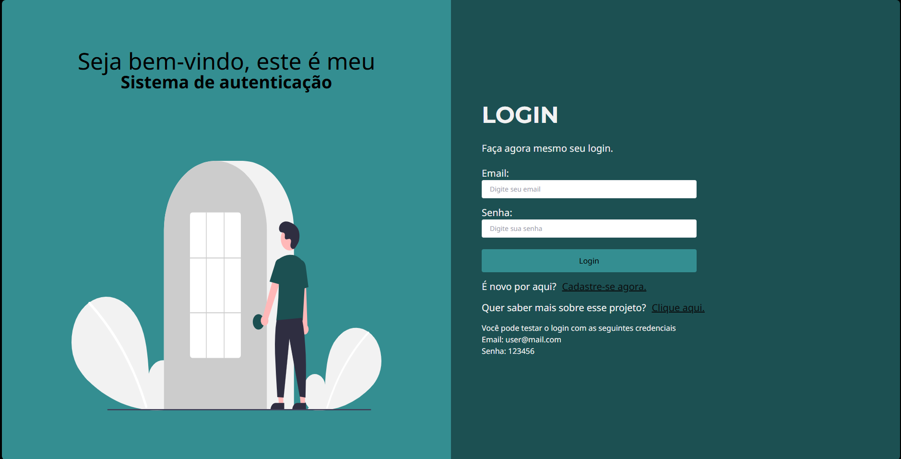

[PROJECT__BADGE]: https://img.shields.io/badge/📱Visit_this_project-000?style=for-the-badge&logo=project
[PROJECT__URL]: https://jwt-authentication-system-nine.vercel.app/

<p align="center">
  
</p>

# Página de autenticação
A **Página de Autenticação** é uma aplicação web completa projetada para oferecer uma experiência robusta e segura de autenticação de usuários. Desenvolvida com tecnologias modernas, esta aplicação visa proporcionar não apenas funcionalidades essenciais de login e registro, mas também um ambiente seguro e escalável para gerenciamento de acesso a recursos e páginas protegidas

[![project][PROJECT__BADGE]][PROJECT__URL]
## Tecnologias

[](https://skillicons.dev)

## Motivação, Desafios e Lições Aprendidas

### A Motivação 💪

A motivação por trás da criação desta aplicação foi impulsionada pelo desejo de adquirir conhecimento profundo e prático sobre autenticação de usuários, implementação de rotas protegidas e uso eficiente de tokens JWT.

A Página de Autenticação foi criada com o objetivo não apenas de oferecer uma solução de autenticação eficiente, mas também como um projeto base que pode ser reutilizado e expandido em diferentes aplicações web. Este projeto serve como uma plataforma de aprendizado contínuo, abrangendo desde conceitos fundamentais de segurança até técnicas avançadas de gerenciamento de estado em aplicações React. Estou entusiasmado para aplicar o que aprendi em projetos futuros, contribuindo para aplicações mais robustas, seguras que beneficiem os usuários finais.

### Os Desafios 🚀

- **Context API** Inicialmente, enfrentei dificuldades em compreender o funcionamento da Context API do React, especialmente em relação à sua aplicação em cenários de autenticação e autorização.
Explorei a documentação oficial do React e tutoriais práticos para aprofundar meu entendimento sobre como criar e utilizar contextos de forma eficaz.

- **Manipulação de Tokens JWT:** A manipulação segura de tokens JWT, incluindo o armazenamento e a atualização dinâmica no Local Storage do navegador, representou um desafio inicial.
Estudei boas práticas de segurança para armazenamento de tokens e implementei soluções que garantem a integridade e segurança das informações do usuário.

### Lições Aprendidas 🌟

- **React:** Aprofundei meus conhecimentos em React, aprendendo a criar componentes reutilizáveis, gerenciar estados locais e lidar com eventos. Explorei diferentes técnicas de gerenciamento de estado, como o uso de `useState` e `useEffect` `usenavigate` aprendi tambem a lidar com `context`.
- **JWT (JSON Web Tokens)**: Avancei meus conhecimentos em segurança e autenticação ao aprender sobre JWT (JSON Web Tokens). JWT é um padrão aberto (RFC 7519) que define um método compacto e autossuficiente para transmitir informações com segurança entre as partes como um objeto JSON. Aprendi como JWT pode ser utilizado para autenticar usuários de forma segura e eficiente em aplicações web.
- **Prisma:** Aprofundei meu conhecimento na Orm Prisma
- **Integração Fullstack:** Integrar o back-end (com Prisma) e o front-end (com React) me proporcionou uma visão completa do desenvolvimento de aplicativos. Compreendi como as partes se comunicam por meio de APIs REST.
- **Boas Práticas:** Aprendi a seguir boas práticas de organização de código, como dividir componentes, modularizar funcionalidades e manter um código limpo e legível.

Esses desafios e lições foram cruciais para meu desenvolvimento como desenvolvedor fullstack, e estou animado para continuar aprimorando minhas habilidades e explorando novas tecnologias.

## Primeiros passos

Para começar a desenvolver este projeto, siga as instruções detalhadas nos READMEs das pastas específicas:

1. **Clonar o Repositório**:
   ```bash
   git clone https://github.com/alyssonrafael/JWT_authentication_system
    ```
2. **Leia os READMEs:**

    - [Instruções para o Back-end](./backend//readme.md)
    - [Instruções para o Front-end](./frontend/README.md)

## Licença

Este software está disponível sob as seguintes licenças:

- [MIT](https://rem.mit-license.org)

<h2 id="colab">✒️ Agradecimentos</h2>

<table style="border-collapse: collapse; width: 100%;">
  <tr>
    <td style="padding: 20px; border: 1px solid #ccc; text-align: center;">
      <a href="https://github.com/alyssonrafael" style="text-decoration: none;">
        <br>
        <b>Alysson Rafael</b>
      </a>
    </td>
    <td style="padding: 20px; border: 1px solid #ccc;">
      Gostaria de expressar minha sincera gratidão a todos que contribuíram para este projeto! Seja com sugestões, correções de bugs ou simplesmente com palavras de incentivo, cada um de vocês fez a diferença. 🚀 Obrigado pelo seu apoio !
    </td>
  </tr>
</table>

